# 0. 问题

1. samba
2. gcc

# 1. linux 系统编程

## 1. 什么是linux 系统编程

  linux 系统编程也叫 linux下的高级编程，是介于应用层和驱动层之间的

## 2.学习了哪些知识以后可以学习Linux系统编程

 

## 3. 怎么学习linux 系统编程


# 2. linux 系统编程基本程序框架


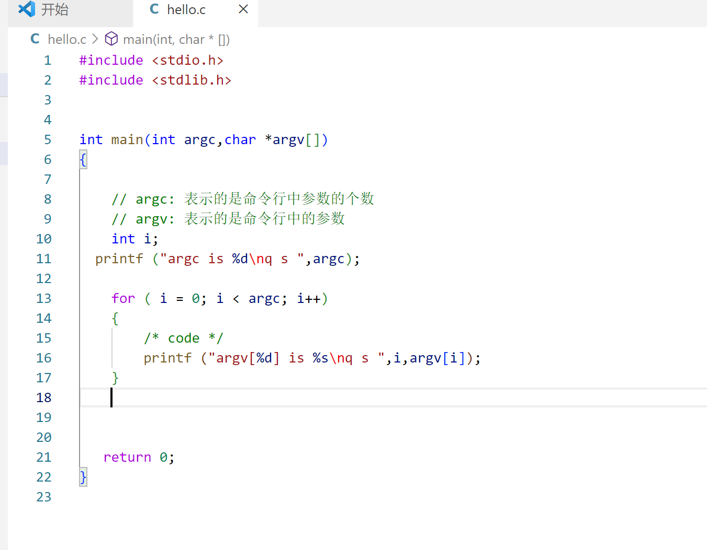


# 3. 标准IO 和文件IO

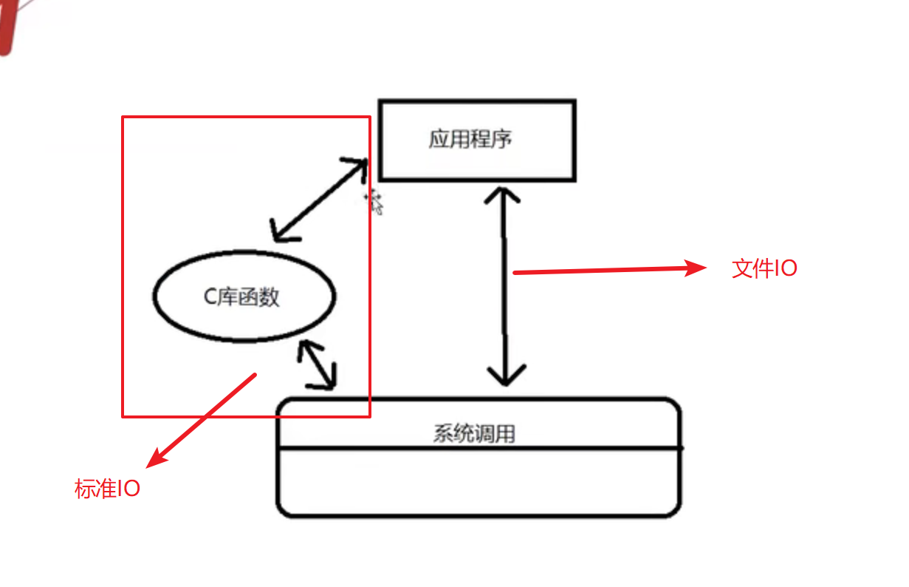

## 1. 什么是标准IO

标准IO就是间接调用系统 调用函数，是C库函数

## 2. 什么是文件IO

文件IO就是直接调用内核提供的系统调用函数

## 3. 文件IO和标准IO的区别

文件IO是直接调用内核提供的系统调用函数，头文件是unistd.h ，标准IO是间接调用系统调用函数，头文件是stdio.h  ,文件IO是依赖linux 操作系统的，标准IO是不依赖操作系统的，所以在任何的操作系统下，使用标准IO，也就是C库函数操作文件的方法都是相同的。

# 4. 文件IO之open函数

## 1. 文件描述符

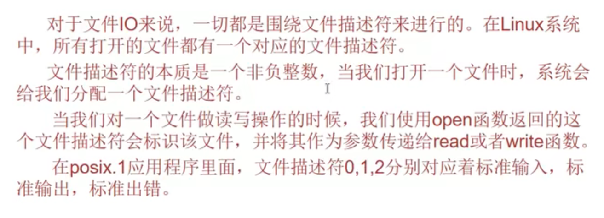

## 2. open 函数

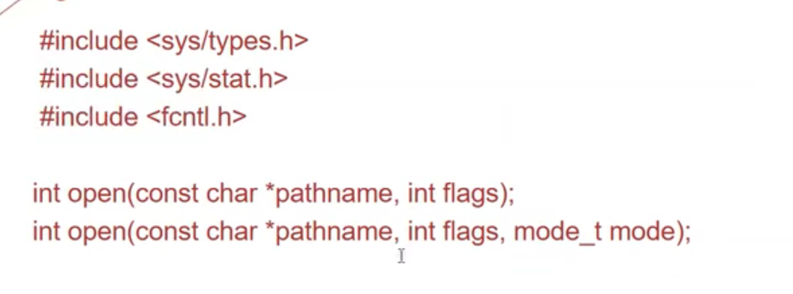

• int open(const char *path, int oflags);

• int open(const char *path, int oflags,mode_t mode);

– 参数path表示：路径名或者文件名。路径名为绝对路径名。

– 参数oflags表示：打开文件所采取的动作

• O_RDONLY文件只读；

O_WRONLY文件只写；

O_RDWR文件可读可写；

O_NOCTTY如果路径指向终端，则不将设备作为此进程的控制终端

• O_NDELAY非阻塞方式操作文件 – mode表示：设置创建文件的权限。权限的宏定义很麻烦，可以直接用数 字替代

– 返回值：出错返回-1；否则返回文件句柄

## 3. 文件的权限

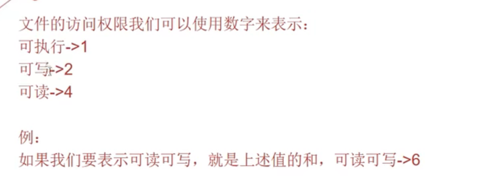

 

# 5. 文件IO之close 函数


## close函数

```c
#include <unistd.h>


int close(int fd);
```

作用：关闭一个文件描述符

为什么要关闭文件描述符呢？   因为文件描述符是有限的，最多1024个


# 6. 文件IO之read函数


在函数原型中，

ssize_t 指的是返回值；

fd是要读取的文件的文件描述符；

buf是万能指针，一个任意类型的指针，议案是传进去一个地址；

count是要读取的字节个数。同样地，在ubuntu界面输入：

man 2 read可以查看read函数的相关信息。

该函数的作用是从文件描述符fd所指定的文件中读取“count”字节的大小到“buf”所指向的缓冲序列，它的返回值是实际读取到的字节数。


# 7. 文件IO之write 函数


```
NAME
       write - write to a file descriptor
				 写入一个文件的描述符 
SYNOPSIS
       #include <unistd.h>
											
       ssize_t write(int fd, const void *buf, size_t count);
				参数一： 需要写入的设备 
				参数二： 需要写入的数据缓存区  
				参数三： 需要写入的数据大小  
				返回值：  成功  返回值写入的字节数  
				
						  失败  -1  错误 
								小于用户请求的字节数  写入失败
					

一般使用write 函数进行开发时，我们都是根据数据的真实大小写入。 

注意：使用write 函数的时候，他会根据用户的需求数据写入，假设 
	  真实数据不够，那么write 会自己补充一些乱码数据!!!!! 
	  
	  例子： 
	  char buf[1024]={"hello"};  //真实数据为5个字节  
	  write(fd,buf,1024);   	 //最后写入的是1024个字节， 1024 - 5 (个无效数据) 

```


# 8. 综合练习 一


```
练习方式：
 1 .查看man 文档  read  write  open  close  man 文档第二页
 	查看方式 : man 2 read 
 2. 注意头文件，可以在man文档中查看
 3. 函数参数在man文档中也可以查看
```

## 读取一个文件到另一个文件中	


```c
#include <stdio.h>
#include <stdlib.h>
#include <sys/types.h>
#include <sys/stat.h>
#include <fcntl.h>

#include <unistd.h>

int main(int argc,char *argv[])
{

    // argc: 表示的是命令行中参数的个数
    // argv: 表示的是命令行中的参数


    // 步骤一： 判断命令行中的参数
    if(argc!=3){
        printf("Usage: %s <src file> <obj file>\n",argv[0]);
        return -1 ;
    }

    // 步骤二： 定义变量
    int fd_src,fd_obj;
    char buf[32]={0};
    ssize_t ret;


    // 步骤三： 打开文件获得文件操作符 
    fd_src=open(argv[1],O_RDWR);
    if(fd_src<0)
    {
        printf("open src file  is error\n");
        return -1;
    }
    fd_obj=open(argv[2],O_RDWR|O_CREAT,0666);
    if(fd_obj<0)
    {
        printf("open obj file is error\n");
        return -1;
    }


    // 步骤四 ：读写操作

    while((ret=read(fd_src,buf,32))!=0)
    {
        write(fd_obj,buf,ret);
        //write(fd_obj,buf,32);  两者都可以，ret是read实际读到的字节数   
    }


    close(fd_src);
    close(fd_obj);
   return 0;
}

```


# 9. 文件IO之 lseek 函数

## 函数：

功能： 修改文件的位置指针，在读取文件中，会是使用文件的位置指针	


## 参数：

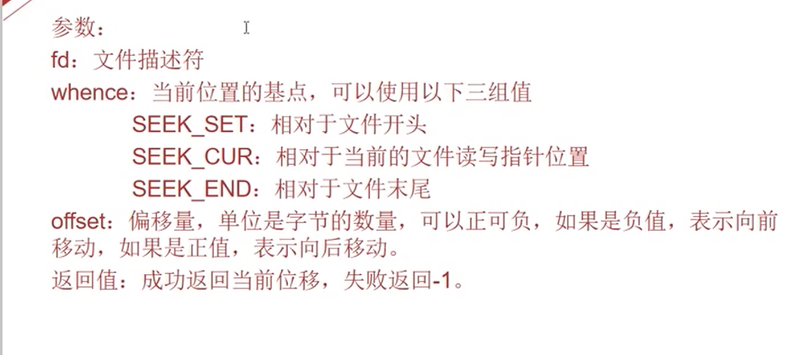

## 例子：


# 10. 目录IO之mkdir函数

位置; man 2 mkdir 

## 1. 文件IO和目录IO对比

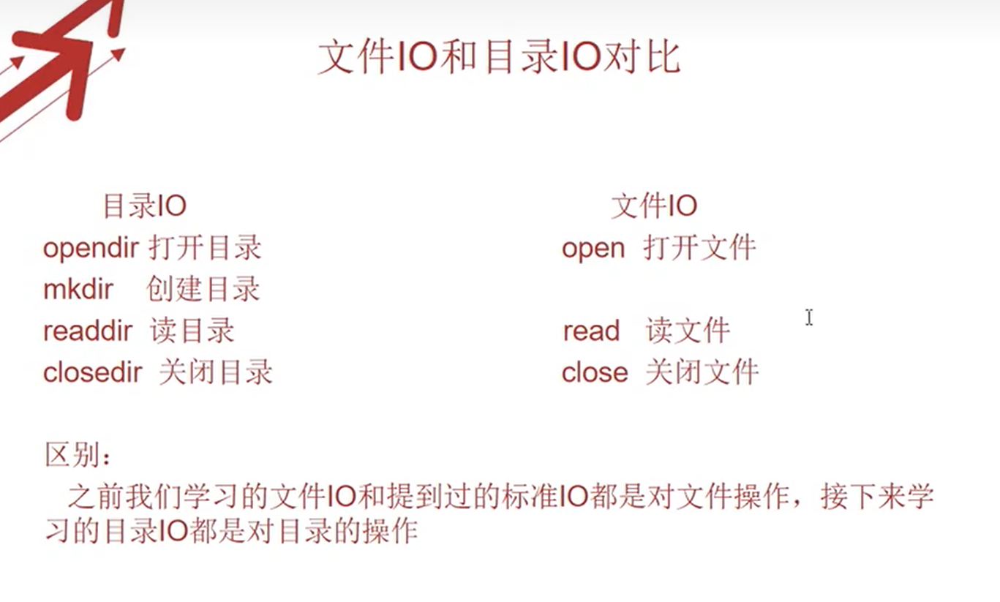


# 11. 目录IO之opendir 和closedir函数


位置： man  3 opendir 

## 1. opendir


## 2. closedir函数


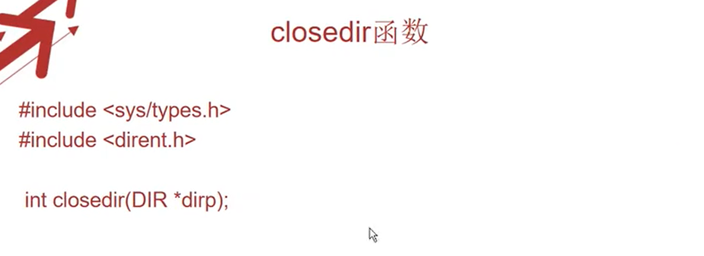


# 12. 目录IO之readdir 函数


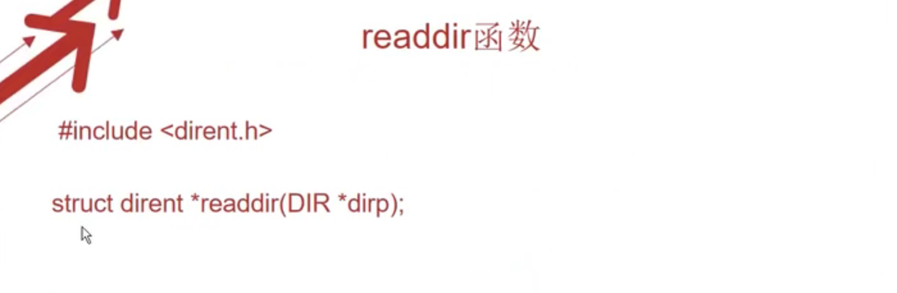


# 13. 综合练习二

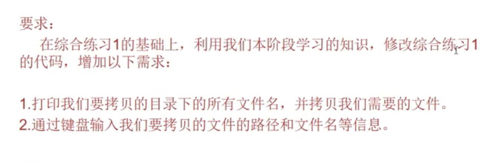

```c
#include <stdio.h>
#include <stdlib.h>
#include <sys/types.h>
#include <sys/stat.h>
#include <fcntl.h>

#include <unistd.h>
#include <dirent.h>

#include <string.h>

int main(int argc,char *argv[])
{

    // argc: 表示的是命令行中参数的个数
    // argv: 表示的是命令行中的参数


    // 步骤二： 定义变量
    int fd_src,fd_obj;
    char buf[32]={0};
    char dir_path[32]={0};  //需要读取的文件的路径
    char file_name[32]={0};  //需要读取的文件的路径
    ssize_t ret;
    DIR *dp;                 // 读取文件描述符指针
    struct dirent *dir;      // 读取文件返回的结构体指针
    


  

    printf("please arm dir_path:\n");
    scanf("%s",dir_path);

    dp= opendir(dir_path) ;  

    if(dp==NULL)
    {
        printf("opendir is error ");
        return -1;  
    }

    printf("opendir is success");
    while(1)
    {
       dir=readdir(dp);
        if(dir!=NULL)
        {
            printf("file name is %s\n",dir->d_name);
        }
        else
        {
            break;
        }
    };

    printf("please enter file name:\n");


    scanf("%s",file_name);


    fd_src = open(strcat(strcat(dir_path,"/"),file_name),O_RDWR);


    if(fd_src<0)
    {
        printf("open is error ");
        return -3;
    }

    fd_obj = open(file_name,O_RDWR|O_CREAT,0666);


    if(fd_obj<0)
    {
        printf("open is error");
        return -2;
    }


    while (ret = read(fd_src,buf,32)!=0)
    {
        write(fd_obj,buf,ret);

    };
    


    close(fd_src);
    close(fd_obj);
   return 0;
}

```


# 14. 库的基本概念

## 1. 什么是库

库是一种可执行的的二进制文件，是编译好的代码

## 2. 为什么要使用库

提高开发效率


## 3. linux 下库的种类

### 1. 静态库

静态库在在程序编译的时候会被链接到目标代码里，所以我们程序运行就不需要静态库，因此编译出来的体积比较大

### 2. 动态库

静态库在在程序编译的时候不会被链接到目标代码里，而是在程序运行的时候被载入的，所以我们程序运行需要动态库，因此编译出来的体积比较小

### 3. 静态库和动态库的区别

1. 静态库 以 lib开头，.a 结尾
2. 动态库 以lib 开头，.so 结尾


# 15. 静态库的制作与使用

## 1. 静态库的制作

1. 编写或准备库的源代码
2. 将源代码.c 文件编译生成.o 文件
3. 使用ar命令创建静态库
4. 测试库文件

libmylib.a   库文件名

mylib ： 库名


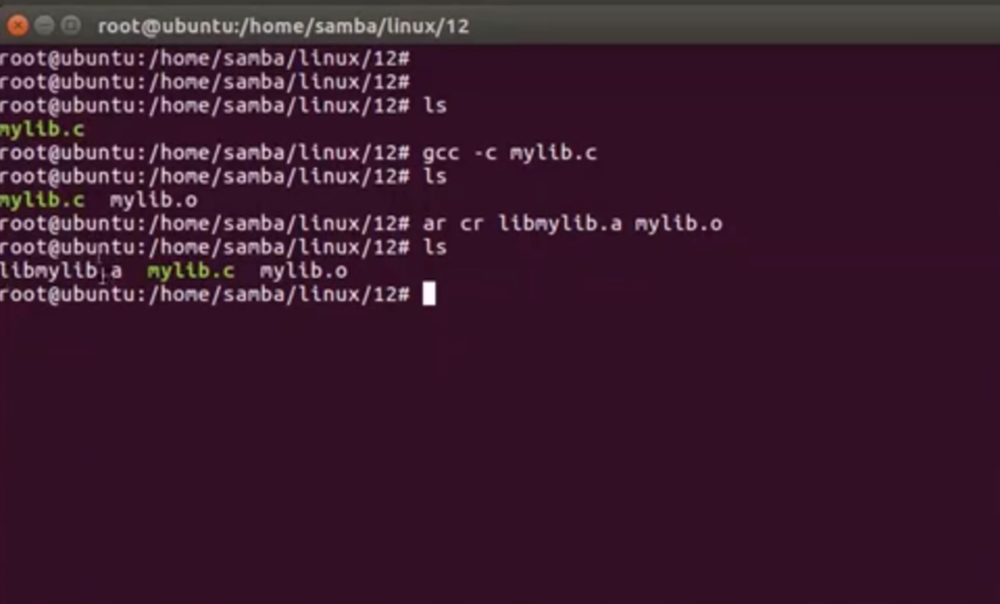


## 2. 静态库的使用

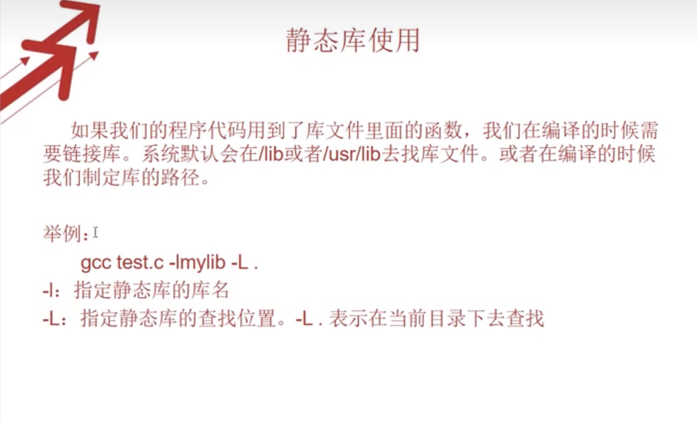


# 16. 动态库的制作与使用


## 1. 动态库的制作

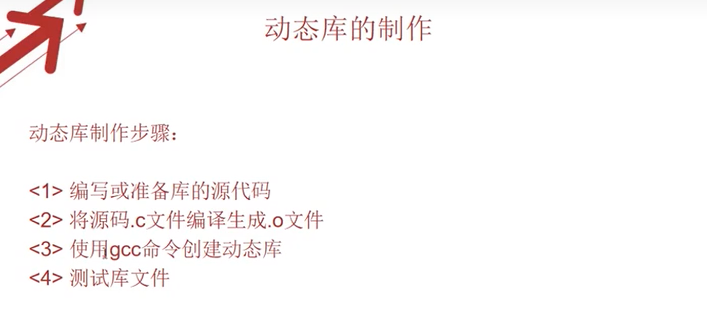

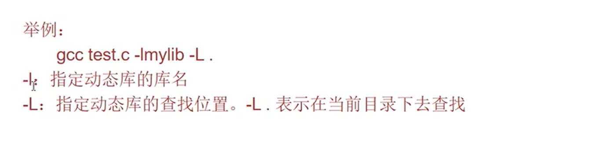

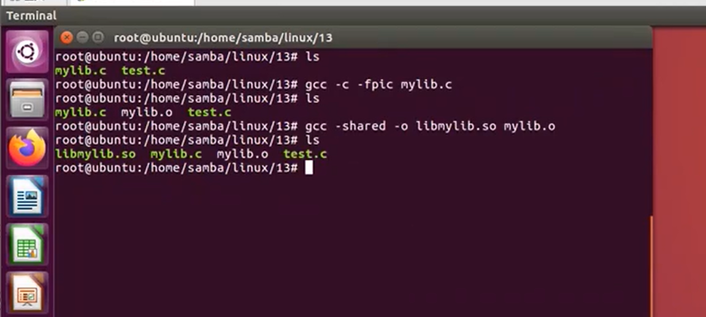


